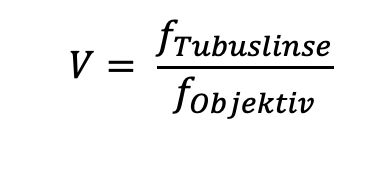
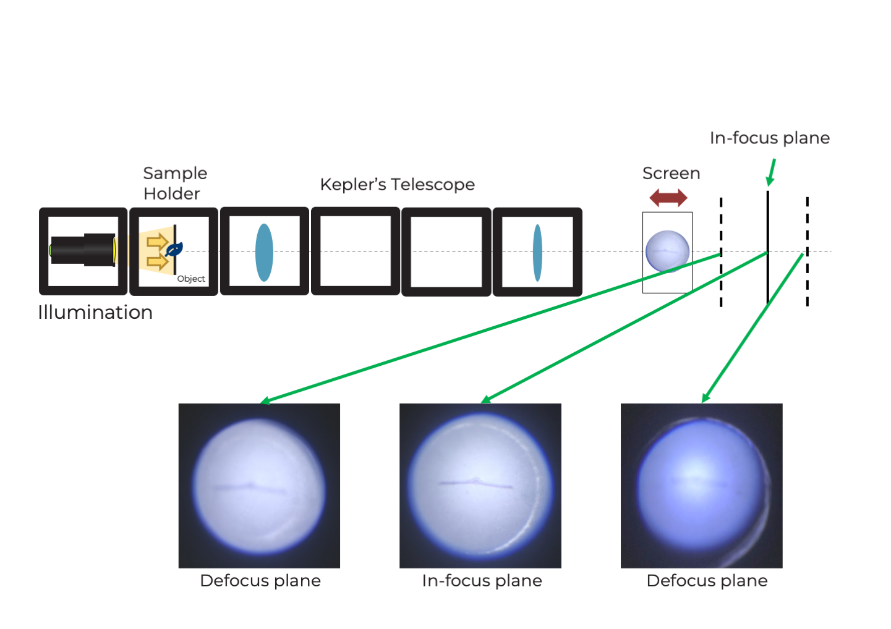
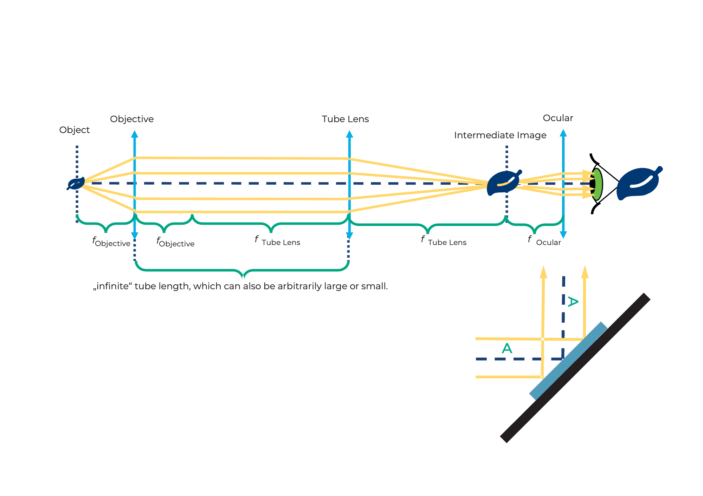
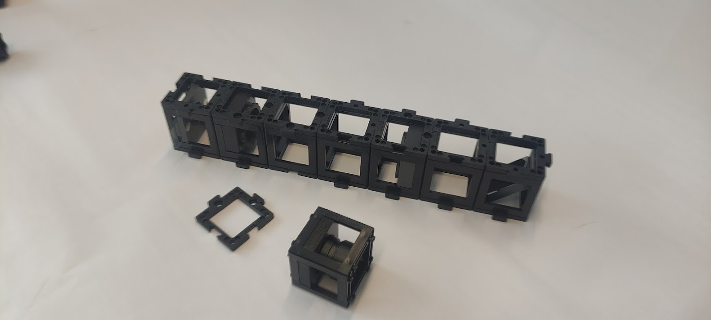
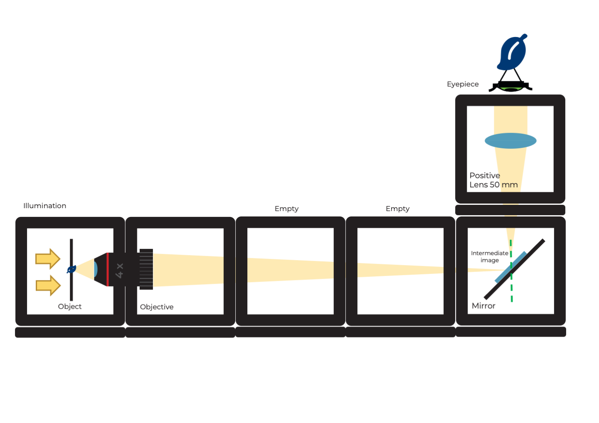
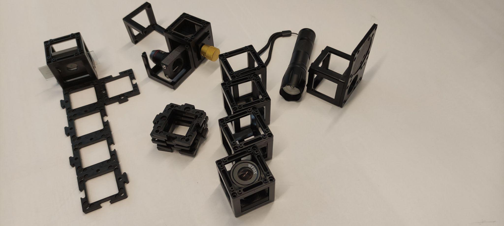
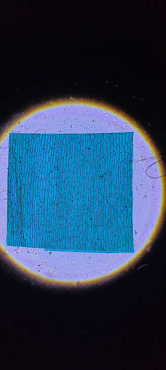
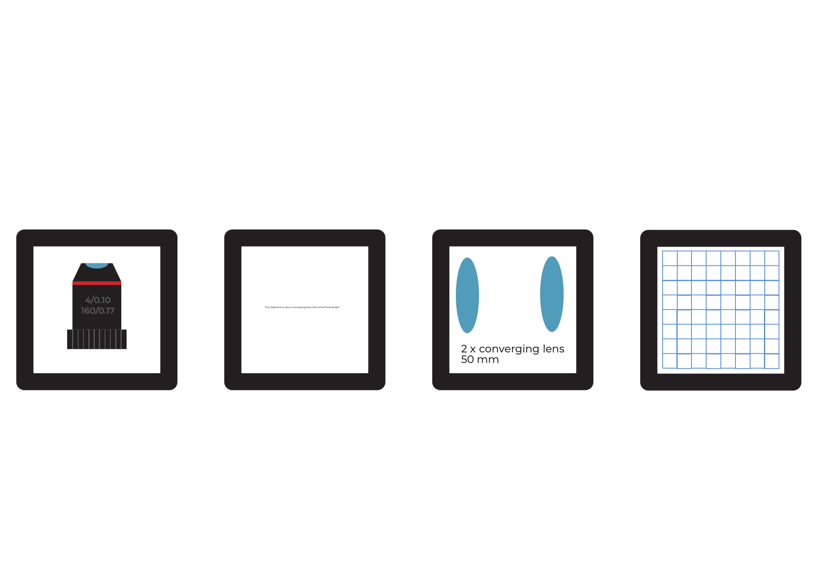
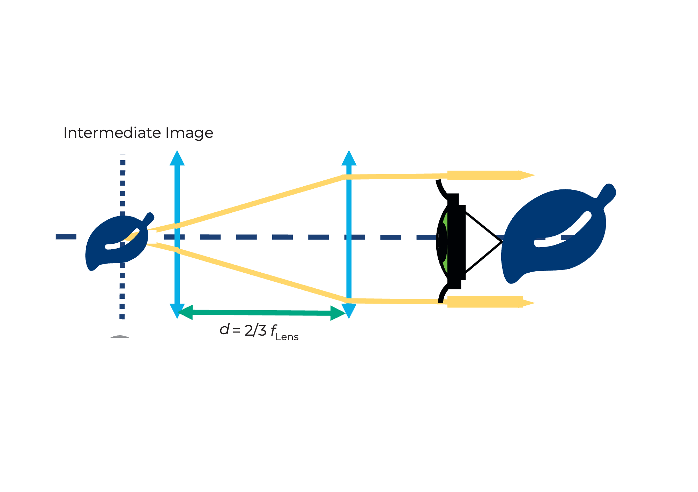
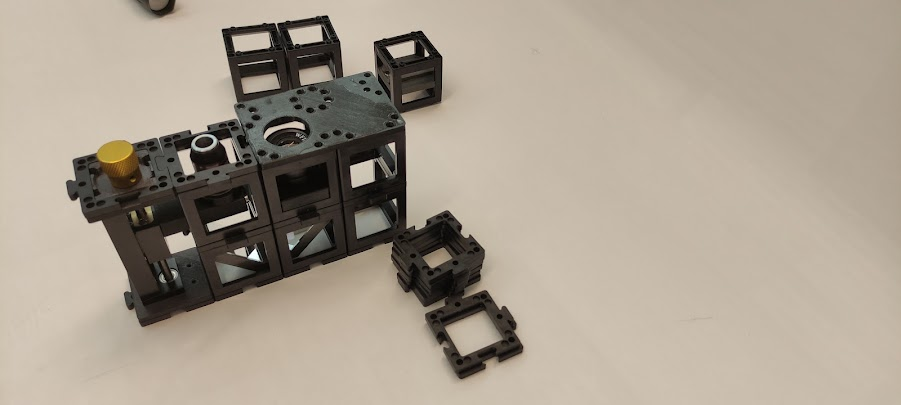

## Light microscope with "infinity optics"

What happens when you turn the Kepler telescope upside down?

 

Place the object about 40mm in front of the lens and find the image about 100mm behind the tube lens (using a paper or the wall as a screen) as shown in the diagram. Move the lenses to get a sharp image.

Place the object with the lens on the paper as one unit. Place the tube lens at a distance of 100mm from your screen (paper, wall). Change the distance between the lenses - does the image change?

 

## This means "infinity optics"

A microscope is a device that allows objects to be viewed or imaged at high magnification.

The image is called an **intermediate image** because it is often further enlarged with an eyepiece.

The object is roughly in the object-side focal plane of the lens. Thus, all incident rays are converted into a parallel bundle of rays behind the lens. The lens has a short focal length.

The tube lens creates a real image by collecting parallel rays that hit the tube lens in its focal plane. If we place them behind the lens, the object will be imaged from the focal plane of the lens. The tube lens has a longer focal length than the objective.

The image in the plane of the intermediate image is reversed, flipped, enlarged and real. The real image can be seen on a screen.

 

## This means "infinity optics"

What is the magnification of the image?

Magnification of the image

The lenses of the Kepler telescope can also be used for a microscope, but in a different order.
As long as the object is in the focal plane of the lens and the screen is in the focal plane of the tube lens, the distance between the lens and tube lens does not matter because the light rays are parallel.

 

## Tutorial: Light Microscope with Infinity Optics

### Materials needed:

- Kepler's telescope
- Torch lamp
- Sample holder (in cube) with sample

### Diagram (side view):

### Instructions for assembling the Light Microscope with Infinity Optics:

**Step 1: Add the sample**

Add the sample cube behind to the 50 mm positive lens. Don’t forget to add the base plates.

**Step 2: Fix the cubes with base plates**

Use the torch to illuminate the sample. Look for a screen (notebook, piece of paper) to project the image onto.

**Step 3: Adjust the distance**

Turn off ambient light to see the image on the screen clearly. Adjust the distance between the microscope and the screen until you see a sharp focused image (check the diagram).

## "Infinity optics" microscope with eyepiece

Can you see the microscopic image through the eyepiece lens with your eyes? What effect does the mirror have? Set up the microscope without the mirror. Make sure you still have two empty spaces between the tube lens and the eyepiece. Then what are you observing?

 

A quick intro into mirrors and its applications can be found here:

<iframe width="560" height="315" src="https://www.youtube.com/embed/azxLqej7yqU" title="YouTube video player" frameborder="0" allow="accelerometer; autoplay; clipboard-write; encrypted-media; gyroscope; picture-in-picture" allowfullscreen></iframe>

## What is the eyepiece good for?

Newer microscopes are equipped with so-called "infinity optics". In this case, the lens does not produce a real intermediate image. The light exits the lens as infinite parallel rays. At the end of the "infinite" tube is a tube lens. This creates an intermediate image, which is then enlarged again through the eyepiece.

The image behind the eyepiece is reversed, reversed, enlarged and virtual. The virtual image can be seen with the eye.

This configuration is very useful in modern microscopes as it allows additional components such as filters to be placed between the objective and tube lens without affecting the optical path.

A filter can be used to change the brightness and color of the image.

 

## The eyepiece is good for that

What is the magnification after the eyepiece?

overall magnification

An eyepiece is actually just a lens that enlarges the intermediate image. It maps the virtual image in such a way that you can see it with your eyes.

 

With the mirror you can not only see yourself, but also reflect the incoming light in any direction. So you can fold the optical path and make it more comfortable to work with. The mirror doesn't affect the magnification, but it does rotate the image in one direction.

 

## Tutorial: Light Microscope with Infinity Optics and Eyepiece

### Materials needed:

- Kepler's telescope
- Torch lamp
- Eight base plates
- Sample holder (in cube) with sample
- Mirror (in cube)
- Empty cube
- Eyepiece (in cube)

### Diagram (side view):

### Instructions for assembling the Light Microscope with Infinity Optics and Eyepiece:

**Step 1: Add the sample-holder cube**

Add the sample-holder cube in the Kepler's telescope next to the 50 mm converging lens.

**Step 2: Assemble next to the 100 mm lens**

Next to the 100 mm converging lens, assemble one empty cube and the mirror cube next to it.

**Step 3: Place the eyepiece**

Place the eyepiece on top of the mirror cube with the right orientation. Illuminate the sample from a considerable distance.

**Step 5: Adjust for a sharp image**

Look through the eyepiece. Adjust the lenses distance until you see a focused sharp image. Note: If you don’t see the specimen try to adjust the slide’s position carefully until you see the specimen.

## Light microscope with "finite optics"

Place the dice in the positions shown in the diagram below and look through the eyepiece.

Build the microscope like a sandwich by adding a second layer using a base plate. Look through the eyepiece from above.

 

Do you see the image through the eyepiece as before? Can you find the real intermediate image with a piece of paper?

 

Turn the small gear on the lens holder. This is how you move or focus the lens. If you can't go any further, you can also move the lens in the holder.

 

## Tutorial: Light Microscope with Finite Optics and Eyepiece

### Materials needed:

- Microscope objective (4x) with gear mount (linear stage)
- Torch lamp with lamp base
- Twelve base plates
- Sample holder (in cube) with sample
- Mirror (in cube)
- Three empty cubes
- Eyepiece (in cube)

### Diagram (side view):

## Instructions for assembling the Light Microscope with Finite Optics:

**Step 1: Connect the base plates**

Connect the base plates in the following way.

**Step 2: Place the sample**

Place the sample on the leftmost plate.

**Step 3: Build and place the cubes**

Build a cube with the microscope objective inside and place both microscope objective and gear cubes in the next two base plates. Include all additional images as shown.

**Sub Step 1:**

**Sub Step 2:**

**Sub Step 3:**

**Step 4: Reflect the light**

Place two empty cubes and the cube with the mirror at the last base plate such that it reflects the light coming from the sample upwards.

**Step 5: Secure the cubes**

Place the base plates on top of the cubes to fix them tightly.

**Step 6: Attach the eyepiece**

Place the eyepiece on top of the mirror cube. Mind the right orientation of the eyepiece.

**Step 7: Illuminate the sample**

Fix the lamp with a base and illuminate the sample from a considerable distance. Look through the eyepiece and adjust the microscope distance using the gear until you see a focused image of the specimen.

## "Finite optics" versus "Infinite optics"

The lenses of older or smaller microscopes are often so-called finite lenses. They behave like a lens with an extremely short focal length and create an intermediate image behind the lens with an image distance that is defined by the tube length. The tube length is printed and corresponds to 160mm for our lens. The real intermediate image is created there and is enlarged by the eyepiece optics.

Microscopes have the ability to focus or sharpen the object either by moving the object or the lens. Here we move the lens through a simple mechanism. The rotation of the gear is translated into a displacement of the objective lens. For larger movements, you can also move the lens in the rail.

 

## "Finite optics" versus "Infinite optics"

What is the magnification of the intermediate image? And what is the magnification after the eyepiece?

lens magnification

as written on it

eyepiece magnification

overall magnification

The image is larger than with the infinity microscope. The magnification of the lens here is 4×. If you calculated the magnification with the previous microscope, this certainly doesn't surprise you.

 

The intermediate image is now only formed by the lens and is 160 mm behind it. We'll find out why in the next step.

 

## Objective and eyepiece

 

## This is the lens

A lens is an optical system that creates a magnified image of an object. The different numbers printed on the lens have different meanings:

The 4× lens has only one lens in it. The lenses with higher magnification are complete lens systems.

The lens is also a converging lens with a short focal length. The 4x lens has a focal length of f=32 mm. When used as a magnifying glass, it has a higher magnification than the 40mm lens. The field of view is sharp but small.

 

## The eyepiece

An eyepiece is actually a magnifying glass because it enlarges the intermediate image. The eyepiece we use here is a so-called Ramsden eyepiece.
A single lens can also be used as an eyepiece. However, with a Ramsden eyepiece consisting of a lens system, the field of view is better because it creates fewer errors at the edge of the field of view. The Ramsden eyepiece consists of two lenses with the same focal length. Its focal length is f Ramsden eyepiece = 3/4 f lens

What is the magnification of the Ramsden eyepiece?

Each eyepiece has a so-called Ramsden disk, which is the smallest diameter of the light beam that exits the microscope through the eyepiece.

 

The field of view is larger and the image looks clearer with the Ramsden eyepiece.
Each eyepiece has a so-called Ramsden disc, which is the smallest diameter

 

## Smartphone microscope

Build the smartphone microscope as shown. Use any two cubes here to safely place the smartphone.

 

Build the microscope like a sandwich by adding a second layer using a base plate. Look through the eyepiece from above.

 

Replace the Ramsden eyepiece with the 40mm lens. What is better for the eye and what for the smartphone?

 

## Tutorial: Smartphone Microscope

### Materials needed:

- Microscope objective 4x
- Microscope objective long mount with gear
- Ramsden-Eyepiece (in cube)
- Two non-kinematic mirrors (in cubes)
- Sample holder (in cube)
- Three empty cubes
- 11 base plates
- Smartphone base plate
- Torch lamp
- 50 mm lens (in cube)

### Diagram (Side view):

## Instructions for assembling the Smartphone Microscope:

**Step 1: Build a four-base plate line**

**Step 2: Assemble the components**

Place the Microscope objective mount on one extreme followed by the two mirrors facing each other and one empty cube in the other extreme. Fix them with base plates.

**Step 3: Adjust the objective**

Build one cube with the microscope objective inside. Adjust the objective's height if necessary by using the gear.

**Step 4: Place the eyepiece**

Place the eyepiece next to the microscope objective and one empty cube next to it. Mind the right orientation of the eyepiece.

**Step 5: Align the smartphone base**

Place the smartphone base with the hole aligned with the eyepiece. Note: You can adjust the orientation of the smartphone base to adapt your smartphone's size.

**Step 6: Set up the sample holder**

Place the sample holder cube on top of the microscope objective. Mind the distance between them. You can adjust the coarse distance by sliding the sample holder inside the cube and the finer distance by using the gear.

**Step 7: Add the converging lens and lamp**

Place a converging lens cube on top of the sample holder cube and place the torch lamp on top. Place the smartphone aligned to the eyepiece.

**Step 8: Adjust for clarity**

Try to move the smartphone such that the whole eyepiece circle appears illuminated. Then, turn the gear to focus and get a sharp image of the specimen.

## Better with smartphone or eye?

The smartphone camera has a lens with a very short focal length because it has to fit into the thin smartphone. The lens then creates an image on the camera sensor whose properties are similar to those of the human eye.

The eye can see objects from both a distance and near. This property is called accommodation.

The smartphone camera can also do this, but it is called autofocus. It describes the ability to sharply image objects at different distances on the sensor.

The image from the eyepiece comes in parallel rays, as if coming from infinity. You observed with a relaxed eye (looking into the distance) or with a camera focused at infinity.

 

## Calculation results

