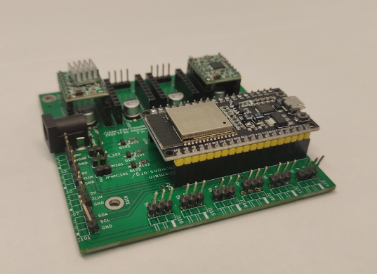
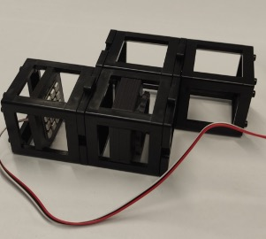
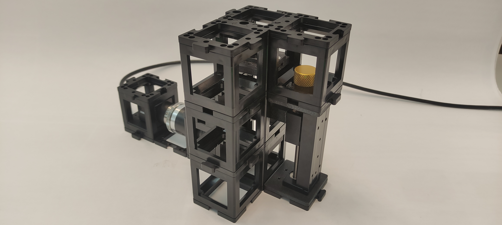

# Differential Phase Contrast

Differential Phase Contrast Microscopy is a Computational Imaging technique that uses partial coherent sources to illuminate a sample at various angles. The angle determines the illumination NA which contributes to the final resolution due to the oblique illumination.
...
### The role of the diffuser
A diffuser is a dispersive element that changes the path of light in a random way resulting in a continuous illumination source instead of a sum of discrete sources.

Imaging we are doing a DPC experiment and we illuminate the sample with half-circle illumination. We compute the WOTF and PTF of the system. In Figure a) one can see what happens to the information in Fourier space. The discrete source causes phase jumps (non-smooth) transitions between different frequency regions reaching to the camera. If we add a diffuser we get the source to be more continuous-like which in turn makes the WOTF and hence the PTF smoother as shown in Figure b).

The diffuser also gets rid of coherent artifacts that are still present when illuminating with discrete sources. (We approximate each single LED as a point source)

## Tutorial: DPC setup

### Materials needed:

- LED array
- Hikrobot Camera (MV-CE060-10UC) with USB cable ([Hikrobot Camera Software installation](Camera_Software_tutorial.md))
- ESP32 Module
- Microscope Objective
- Motorized Linear stage
- Non-Kinematic Mirror
- Sample holder (in cube)
- One empty cube
- 11 base plates
- Tube lens (with camera adapter)

### Diagram:

### Instructions for assembling the DPC setup:
**Step 1: Download Imswitch and the ESP32 microcontroller drivers**

Once the drivers are installed you can visit ([youseetoo.github.io](https://youseetoo.github.io/indexWebSerialTest.html)) to test the LED array pattern sequences.

**Step 2: Mount the LED array**

Mount the LED array into the LED array base plate and insert it in a cube as shown.

**Step 3: Build the DPC setup**

**Substep 1**

Build the camera module as shown. It comprises of a tube lens and a Hikrobot Camera. Adjust the screw which binds the camera to the camera base plate to get the right distance between the camera and the tube lens.

**Substep 2**

Insert the non-kinematic mirror and the linear stage accordingly. Then, place the microscope objective and in the same cube insert a sample holder.

**Substep 3**

Finally, on top, place the led array cube with the dispersive element (diffuser). You can add a second pile of cubes next to the microscope objective to give more support and make the a more stable setup.

**Step 4: Adjust the Source-sample distance**

Using the microscope objective _NA_ and the LED geometry, calculate the distance required from the LED array to the sample. This will determine the illumination _NA_. Use the ruler and adjust the distance moving the sample holder towards the LED array or viceversa. (Revise the theory to calculate the distance correctly according to the match illumination condition).

**Step 5: Focus on the sample**

Turn the LEDs on using Imswitch  and focus on the sample. Be careful if your sample is too transparent, there is a high probability of crashing the objective with the sample! Mind the working distance of your microscope objective. To focus you can use oblique illumination (one LED or one half-circle). This enables some phase gradients to show in the intensity images.

**Step 6: Run the ImDPC experiment!**

Once you have focused on the sample remove the sample and take the Flatfield images (Sequence of images with the DPC patterns with no sample). Then insert the sample again, adjust the desired FoV. Now you are set. Click _Start_ on the DPC widget!

Congrats! You have created a DPC microscope with OpenUC2!

## DPC Images

Using the reconstruction algorithm we can retrieve the phase of the sample.

First test with the OpenUC2-DPC setup:

