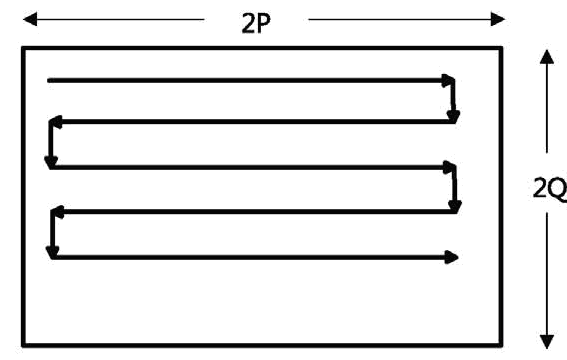

# Histo Scanner

The Histoscanner Plugin is meant to be used for scanning large areas and use the images to stitch them to a large canvas.




https://openuc2.github.io/docs/Investigator/XYZMicroscope/HistoScan

## Starting ImSwitch on Ubuntu and Start the ROI Scanner

First of all: Open the terminal. Type the following (all case sensitive):


<iframe width="560" height="315" src="https://www.youtube.com/embed/bQ3B7uUlJuI?si=CLOexwn4dmZZxFdX" title="YouTube video player" frameborder="0" allow="accelerometer; autoplay; clipboard-write; encrypted-media; gyroscope; picture-in-picture; web-share" allowfullscreen></iframe>

```
conda activate imswitch

sudo chown user:user  /dev/ttyUSB0 # where user is the current user you're logged into (then enter password)
```

The USB port may differ, so perhaps also try this:
```
sudo chown veo:veo /dev/ttyUSB1
sudo chown veo:veo /dev/ttyUSB2
```

Then:

```
python -m imswitch
```

The images are stored in the working directory of the terminal.


<iframe width="560" height="315" src="https://www.youtube.com/embed/WATAgUStyF0" title="YouTube video player" frameborder="0" allow="accelerometer; autoplay; clipboard-write; encrypted-media; gyroscope; picture-in-picture; web-share" allowfullscreen></iframe>
