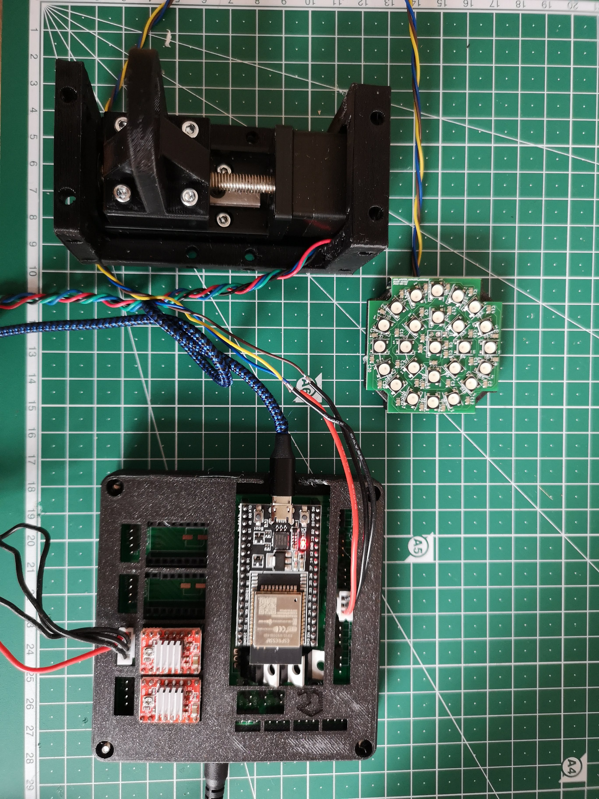

# UC2e - A guide to use the UC2 Electronics

<!----------------------------------------->
## Overview
Duration:1

:::warning
<b>IMPORTANT</b> The system is under constant development and may be subject to changes. If you find any bug or something feels unclear, you can help us improving the system! Feel lucky and file your issue today by opening one here: <a href="https://github.com/openUC2/UC2-REST/issues/new">GitHub: UC2-REST</a>
:::

### What will you learn?
- How to connect the UC2 electronics?
- How to wire up the board with external components
- How to get the playstation controller working?
˘
<!----------------------------------------->
## Introduction into the UC2e Board ("Standalone")
Duration: 5

For a microscsope you have several I/Os that need to be controlled via Software. This majorly concerns:

- Lasers
- Motors (e.g. for positioning)
- LEDs for changing the contrast (e.g. LED Array)
- Sensors (e.g. Endstops)

There exist a number of boards that can do it by default. Here, we created our own driver electronics that is based on the Espressif ESP32 microcontroller unit (MCU) that has:

- 4x Stepper outputs
- 3x PWM outputs for e.g. Lasers
- 1x Neopixel Slot (for the LED Ring Array)
- 3x PWM amplified for e.g. power LEDs
- 1x I2C connection
- USB Serial connection
- 2x DAC (8Bit)

It is based on common "GRBL" boards that drive 3D printers, CNC routers or alike.

A fully assembled board with 12V power, the UC2 LED matrix and the linear stepper motor can be found below:

